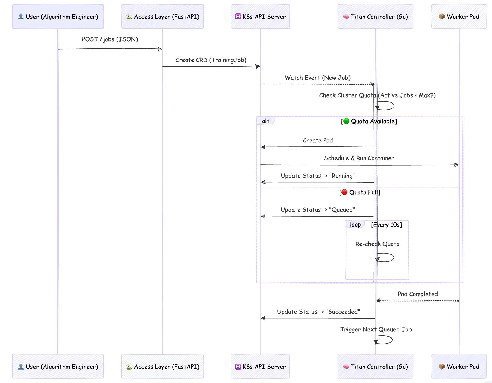
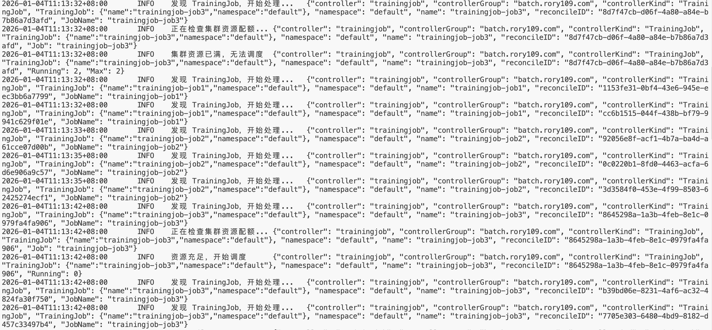
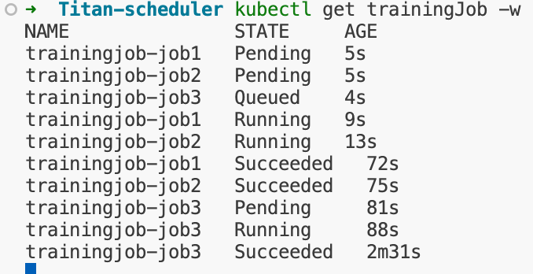

# 🪐 Titan-Scheduler: Kubernetes-Native AI Job Scheduler

## 📖 Introduction

**Titan-Scheduler** 是一个针对 AI 基础设施（AI Infra）场景开发的 Kubernetes 原生调度系统。
它解决了原生 K8s `Job` 资源在处理 AI 训练任务时的局限性，实现了**基于配额的排队机制**、**任务优先级调度**以及**自动化的生命周期管理**。

本项目包含三个核心组件：
1.  **Operator (Go):** 基于 Kubebuilder 开发的核心控制器，负责状态调和与 Pod 管理。
2.  **CRD (TrainingJob):** 自定义的 AI 任务资源定义。
3.  **Job API (Python/FastAPI):** 屏蔽 K8s 复杂性的用户接入层 RESTful 接口。


## 🏗 Architecture

Titan-Scheduler 遵循 Kubernetes 声明式架构设计。以下是任务提交与调度的核心工作流：


## Key Features
Custom Resource (CRD): 定义了 TrainingJob 资源，支持指定镜像、GPU 数量及优先级。

Queueing Mechanism (排队机制): 实现了软调度逻辑。当集群运行任务数达到阈值（如 Max=2）时，新任务自动进入 Queued 状态，防止资源过载。

Auto-Healing (故障自愈): 基于 OwnerReference 实现级联管理。若训练 Pod 被意外删除，Controller 会自动检测并重建，确保任务完成。

User-Friendly API: 提供 Python FastAPI 接口，算法工程师无需通过 kubectl 即可提交和查询任务。

Status Observability: 扩展了 kubectl get 的 Printer Columns，直接在命令行查看任务的实时状态（Pending/Running/Queued/Succeeded）。

## Demo
1. 任务排队与自动补位演示 下图展示了同时提交 3 个任务（系统最大并发为 2）时的调度情况：前两个任务运行，第三个任务排队，待资源释放后自动运行。


2. API 接入演示

```
# 通过 HTTP 接口提交任务
$ curl -X POST "http://localhost:8000/jobs" -d '{"image": "pytorch:2.0", "priority": 10}'

{"message": "任务提交成功", "job_name": "training-job-a1b2", "status": "Pending"}
```
## Quick Start
Prerequisites
Go 1.21+
Docker & Kind (Kubernetes in Docker)
Python 3.9+

1. Setup Environment
```
# 启动本地 K8s 集群
kind create cluster --name titan-cluster

# 安装 CRD 到集群
make install
```
2. Run Controller (The Brain)
```
# 在本地运行 Controller (连接到 Kind 集群)
make run
```
3. Run API Server (The Access Layer)
```
# 启动 Python API 服务
python api/main.py
```
4. Submit a Job
Bash
```
# 使用测试用例提交
kubectl apply -f config/samples/batch_v1_trainingjob.yaml

# 或者使用 API
curl -X POST [http://127.0.0.1:8000/jobs](http://127.0.0.1:8000/jobs) ...
```

## Tech Stack (技术栈)
Core: Golang, Kubernetes Client-go

Framework: Kubebuilder (Controller Runtime)

Interface: Python, FastAPI, Pydantic

Infrastructure: Docker, Kind